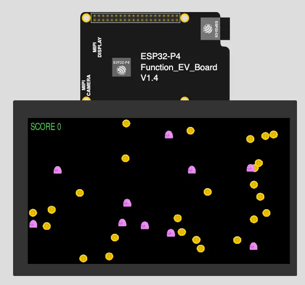

# ESP32 Swift Example


Example of graphical application for ESP32-P4.

## On-line Demo Simulation

[](https://wokwi.com/experimental/viewer?diagram=https%3A%2F%2Fraw.githubusercontent.com%2Fgeorgik%2Fesp32-sdl3-swift-example%2Fmain%2Fboards%2Fesp32_p4_function_ev_board%2Fdiagram.json&firmware=https%3A%2F%2Fgithub.com%2Fgeorgik%2Fesp32-sdl3-swift-example%2Freleases%2Fdownload%2Fv1.0.0%2Fesp32-sdl3-swift-example-esp32_p4_function_ev_board.bin)

[Run the ESP32-P4 SDL3 Swift with Wokwi.com](https://wokwi.com/experimental/viewer?diagram=https%3A%2F%2Fraw.githubusercontent.com%2Fgeorgik%2Fesp32-sdl3-swift-example%2Fmain%2Fboards%2Fesp32_p4_function_ev_board%2Fdiagram.json&firmware=https%3A%2F%2Fgithub.com%2Fgeorgik%2Fesp32-sdl3-swift-example%2Freleases%2Fdownload%2Fv1.0.0%2Fesp32-sdl3-example-esp32_p4_function_ev_board.bin)

## Build

```shell
idf.py @boards/esp32_p4_function_ev_board.cfg flash monitor
```

## Credits

- Graphical assets: https://opengameart.org/content/platformer-tiles
- Font FreeSans.ttf: https://github.com/opensourcedesign/fonts/blob/master/gnu-freefont_freesans/FreeSans.ttf
